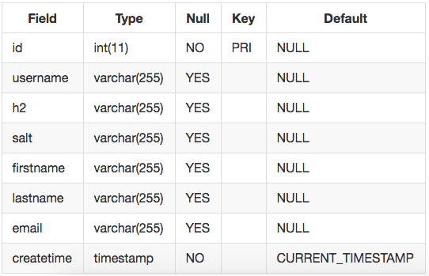
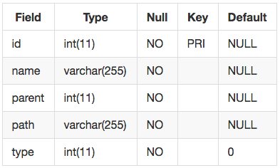
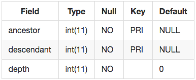

# Cloud Prototype
A prototype of the cloud environment.

## Getting Started

### Prerequisities
Before run the server you need to run mysql first, but no need to create the database.

## 1. Introduction
Recently the cloud computing paradigm has been receiving significant excitement and attention in the media. There exist an increasing number of large companies that are offering cloud computing infrastructure products and service. Cloud database concept is start from sequence that shares a file between two (or many) different servers. In the paper, we have researched fundamental technique, socket programming, database and security, and made a demo cloud database server. For the demo program, we set three specific aims and all implementation is used by Java.

- Specific Aim 1 We will implement client/server model with TCP/IP socket programming.
- Specific Aim 2 We will develop convenient user interface.
- Specific Aim 3 We will implement server synchronization for cloud computing.


### Client
For the client side, we will develop a socket library based on Java socket programming. This library will define the client side protocol which is designed to communicate with the cloud server, and support applications for multiple devices such as the desktop and the mobile phone. Meanwhile, it will also implement the basic functions of cloud client, for instance, login to the account, show the file list of directory and basic file operations.

### Server
For the server side, first of all, we will design socket communication with the client side. This implementation will handle all the requests of client side, including login, list the directory, transfer files and so on. We will define a server side protocol which will manage different types of requests, and also it will include the error detecting. Next, we will design socket communication between multiple server sides, in this project, we will assume there are only two servers. We will implement the synchronization of server side by defining a server side protocol which will be discussed in the aim 3. At last, we will consider about the security policy of server side.


## 2. Backgrounds

### Cloud Computing
Cloud Computing is a technology that uses the internet and central remote servers to maintain data and applications. It allows consumers and businesses to use applications without installation and make it possible to access their personal files at any computer with internet access. This technology allows for much more efficient computing by centralizing data storage, processing and bandwidth.
In cloud computing, there are three segments which are application, storage and connectivity. Each segment serves a different purpose and offers different products for businesses and individuals around the world. In June 2011, a study conducted by V1 found that 91% of senior IT professionals actually don't know what cloud computing is and two-thirds of senior finance professionals are clear by the concept, highlighting the young nature of the technology. In Sept 2011, an Aberdeen Group study found that disciplined companies achieved on average of 68% increase in their IT expense because of the cloud computing and the only 10% reduction in data center power costs.

### Socket Programming
Sockets are network communication channels. The sockets described in this chapter use the TCP network protocol, although you can find Tcl extensions that create sockets using other protocols. TCP provides a reliable byte stream between two hosts connected to a network. It handles all the issues about routing information across the network, and it automatically recovers if data is lost or corrupted along the way. What’s more, TCP is the basis for other protocols like Telnet, FTP, and HTTP.

#### Client Socket
A client opens a socket by specifying the host address and port number for the server of the socket. The host address gives the network location (i.e., which computer) and the port selects a particular server from all the possible servers that may be running on that host. For example, HTTP servers typically use port 80, while FTP servers use port 20. The following example shows how to open a client socket to a Web server

#### Server Socket
A server socket is a little more complex because it has to allow for multiple clients. The way this works is that the socket command creates a listening socket, and then new sockets are created when clients make connections to the server. Tcl takes care of all the details and makes this easy to use. You give the socket command a callback to execute when a client connects to your server socket. The callback is just a Tcl command. It gets as arguments the new socket and the address and port number of the connecting client.

### JFC/Swing
Swing is a GUI widget toolkit for Java. It is part of Oracle's Java Foundation Classes (JFC) – an API for providing a graphical user interface (GUI) for Java programs. Swing was developed to provide a more sophisticated set of GUI components than the earlier Abstract Window Toolkit (AWT). Swing provides a native look and feel that emulates the look and feel of several platforms, and also supports a pluggable look and feel that allows applications to have a look and feel unrelated to the underlying platform.

## 3. Methods

### Program Architecture


### Protocol (HTTP like protocol)
In this project, we will generate HTTP like protocol. Several types of requests will be considered in this project, for example, GET, POST, PUT and DELETE. The GET method is used to get a file or get the name list of a directory. The POST method is used to check authentication or close the connect. The PUT method is used to upload a file. The DELETE method is used to delete a file on cloud. Meanwhile, user cloud define any type of property in the request. The Status code is the same as HTTP protocol, we will use 200, 401, 404 and so on.

```java
// Login
Auth auth = Auth.getInstance();
Connection cnn = new Connection();
auth.setAccount(username.getText(),String.valueOf(password.getPassword()));
cnn.setRequestProperty("Auth",auth.toString());
cnn.setRequestMethod(Connection.LOGIN,"POST");
request(cnn);
```

```java
// Get the path tree
Connection cnn = new Connection();
cnn.setRequestMethod(Connection.GET_PATH,"GET");
cnn.setRequestProperty("Path","");
cnn.setRequestProperty("Auth",Auth.getInstance().toString());
request(cnn);
```

```java
// Upload a file
Connection cnn = new Connection();
cnn.setRequestMethod(Connection.UPLOAD_FILE,"PUT");
cnn.setRequestProperty("Auth",Auth.getInstance().toString());
cnn.setRequestProperty("Content",textArea.getText());
cnn.setRequestProperty("Path",currentPath);
request(cnn);
```

```java
// Delete a file
Connection cnn = new Connection();
cnn.setRequestMethod(Connection.DELETE_PATH,"DELETE");
cnn.setRequestProperty("Auth",Auth.getInstance().toString());
cnn.setRequestProperty("Path",currentPath);
request(cnn);
```

```java
// Lock a file
Connection cnn = new Connection();
cnn.setRequestMethod(Connection.LOCK,"POST");
cnn.setRequestProperty("EditMode","");
cnn.setRequestProperty("Path",currentPath);
cnn.setRequestProperty("Auth",Auth.getInstance().toString());
request(cnn);
```

### Client Side
For the client side, we will develop a socket library based on Java socket programming. This library will define the client side protocol, which is designed to communicate with the cloud server, and support applications for multiple devices such as the desktop and the mobile phone. Meanwhile, it will also implement the basic functions of cloud client, for instance, login to the account, show the file list of directory and basic file operations.

### Server Side
For the server side, first of all, we will design socket communication with the client side. This implementation will handle all the requests of client side, including login, list the directory, and transfer files and so on. We will define a server side protocol which will manage different types of requests, and also it will include the error detecting. Next, we will design socket communication between multiple server sides, in this project, we will assume there are only two servers. We will implement the synchronization of server side by defining a server side protocol which will be discussed in the aim 3. At last, we will consider about the security policy of server side.

### Database Implementation
MySQL provides connectivity for client applications developed in the Java programming language with MySQL Connector/J, a driver that implements the Java Database Connectivity (JDBC) API. We can handle the database part with the connector

### Salt Cryptography
Salt is random data that is used as an additional input to a one-way function that “hashes” a password or passphrase. The primary function of salts is to defend against dictionary attacks versus a list of password hashes and against pre-computed rainbow table attacks. A new salt is randomly generated for each password. In a typical setting, the salt and the password are concatenated and processed with a cryptographic hash function, and the resulting output (but not the original password) is stored with the salt in a database. Hashing allows for later authentication while protecting the plaintext password in the event that the authentication data store is compromised.

In the client side, we use the username as a salt combined with password and using SHA_256 to hash this combined string and get H1. Then, client side will pass both username and H1 to the server side. Next, in the server side, we will find the user in database and get another salt which is used in server side and the H2 which was computed when the user account is initialized. At the end, we will hash h1 with the new salt and get string H2_, and the user will be validated if H2_ is the same as H2.



### Models for hierarchical Data
In order to store the file path tree, we are using closure table which is a simple and elegant way of storing and querying hierarchical data.







## 4. Results

### Login Panel
When users try to login the server, Client socket send a message including Id and Password to chosen server.


### Register Panel
Resister panel provides the function that creating new account. The panel rejects a message when Password and Confirm Password contents are different, and server response whether create a new one or duplicate.


### Main Panel
Main panel consists of two sub-panels. Left panel provide file tree, so that users can explore the folder and file. Right panel provide file contents, and also users can edit the contents.


## 5. Discussion


## Built With

* Makefile

```
make serverClean - will create the required database and tables every time and start the server.
make server - will create the required database and tables at first time and start the server.
make client - start the client
make clean - remove all class files
```
